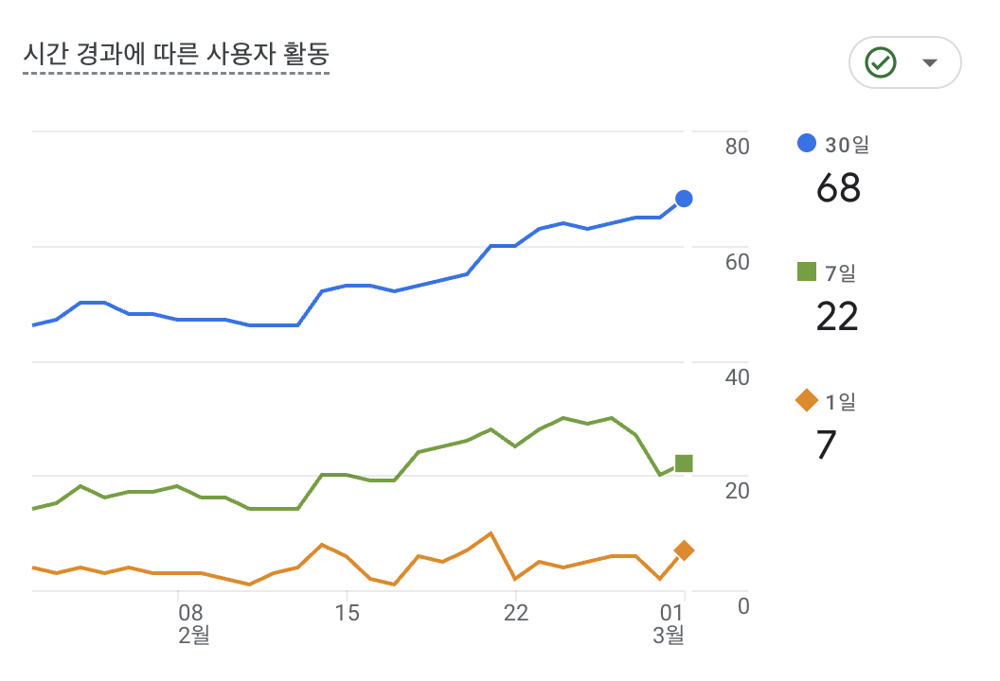
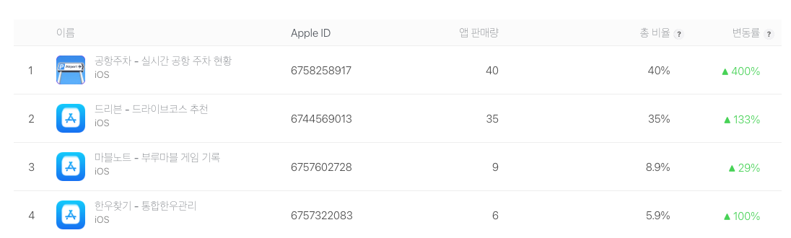

블로그를 2월 12일에 올리고 거의 한달만인데 이번에는 좀 길다. 

## 드리븐 

안드로이드에 출시를 하고 스레드에 몇번 홍보를 하고 2월 앱푸시를 세팅했다. 하루에 약 1-4명정도 신규 가입자가 있는 상태. 
이제는 어느정도 운영레벨로 들어가도 되는 상태라고 보고 있다. 사용 관련 지표는 아래와 같다. 

## 머스트고 -> 꼭 가야할 

약간 앱 이름이 아직은 마음이 안들긴 한데, 어쨋든 아이폰은 출시하고 안드로이드는 출시를 안한 상황. 
데이터를 서울과 제주를 어느정도 채우고 진행을 해야하는데 아직 그러진 못하고 있다. (사실 이건 [cclaw](https://github.com/heg-wtf/cclaw)에 빠져서..)
일단 3월 목표는 서울과 제주 구색을 갖추고 안드로이드까지 가는 것, 아직 iOS는 판매량 자체도 N/A로 떠서 
이것도 안드로이드를 타겟으로 해야겠다.

## 운영레벨

사실상 운영레벨로 들어간 앱들은 실시간 공항주차, 드리븐, 한우찾기, 마블노트 이정도인것 같고 
생각보다 안드로이드 쪽에서 그렇게 다운로드가 많진 않은데 이건 플레이콘솔을 좀 더 공부를 해야할 것 같다. 

사실 구정 연휴 직전에 openclaw에 빠져서 [cclaw](https://github.com/heg-wtf/cclaw)라고 관련 프로젝트를 계속 이어오고 있다. HEG 프로젝트와는 무관하지만 그래도 재밌어서 2주정도 해오고 있는데 이제는 조금 일주일에 1일 정도로 한정해서 진행하려고 한다. 

## [cclaw](https://github.com/heg-wtf/cclaw)

진짜 이번 주 커밋의 대부분이 [cclaw](https://github.com/heg-wtf/cclaw)다. 빌트인 스킬을 대량으로 추가했는데, Supabase, Gmail, Google Calendar, Twitter, Jira, DART 공시, 번역까지 다 넣었다. 이제 텔레그램 봇 하나로 웬만한 건 다 할 수 있게 됐다. 스킬마다 이모지도 달아서 어떤 스킬이 응답하는지 한눈에 보이게 했고, 크론 스케줄러에 타임존 지원도 넣었다.

그리고 `/compact` 명령어를 만들었는데 빌트인 스킬 MD 파일 14개를 압축해서 토큰을 68%나 줄였다. 이건 꽤 뿌듯하다. Global Memory 기능도 추가해서 봇들끼리 기억을 공유할 수 있게 했고, AES-256 암호화 백업 커맨드도 만들었다. 보안 감사 리포트도 한번 돌려봤는데 33개 이슈가 나왔다. 하나씩 잡아야지.

## 네이버/카카오/다이소 CLI

네이버 오픈 API CLI 도구를 새로 만들었다. 검색 API 5종 지원하고 pip으로 설치할 수 있게 했다. 카카오 로컬 API CLI도 같이 만들었고, 다이소몰 상품 검색 CLI도 초기 구현했다. 셋 다 [cclaw](https://github.com/heg-wtf/cclaw) 빌트인 스킬로 연동하려고 만든 건데, 이렇게 작은 CLI 도구들을 조합해서 큰 시스템을 만드는 게 재밌다. 유닉스 철학이랄까.

이번 주는 확실히 도구를 만드는 주였다. 앱 만드는 것도 좋지만 개발 도구를 만드는 건 또 다른 재미가 있다.

